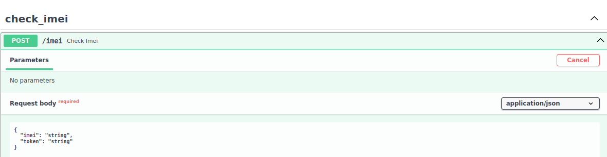
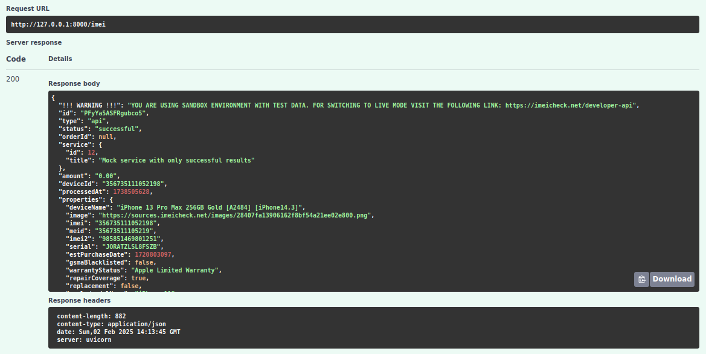
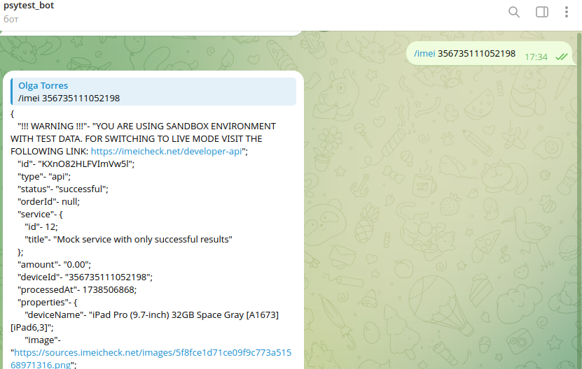

Телеграм бот IMEI

Бэкенд-система для проверки IMEI устройств,
которая будет интегрирована с Telegram-ботом и предоставлять API для внешних запросов.

Реализовано:
- проверка на "белый список" пользователей бота;
- запрос от бота к стороннему API для проверки IMEI;
- запросы к боту через API с проверкой токена.

Бот запускается одновременно с API.

